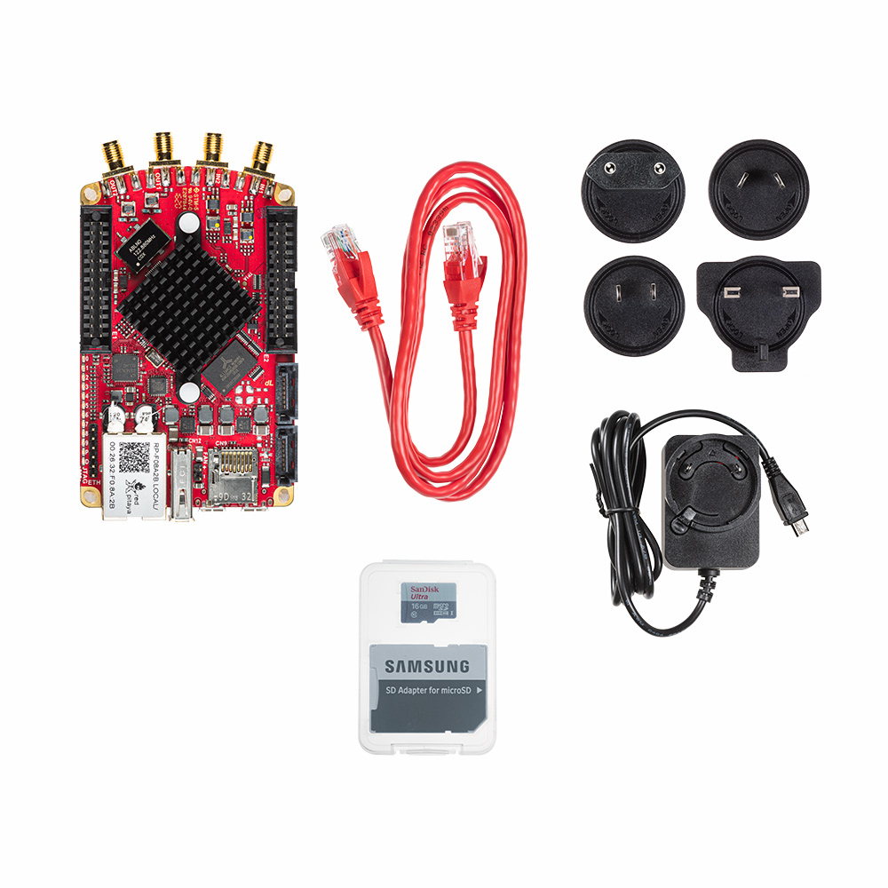

SDRlab 122-16 Standard Kit
##########################

    *SKU: IZD0021*
    

About the product
-----------------

SDRlab 122-16 was developed specifically for software-defined radio and more demanding RF applications. It is tailored for SDR & other RF applications, HF and 50 MHz bands.

It comes with two 16-bit 50-ohm inputs and two 14-bit 50-ohm outputs, Xilinx Zynq 7020 FPGA for real-time processing capabilities plus an ultra-low phase noise 122.88 MHz clock which makes it more hardware-compatible with HPSDR compliant applications. RF inputs are optimized for minimal distortion, noise and crosstalk which significantly improves reception and broadens the choice of antenna.

The board has no DC coupling, with a minimun input frequency (-3 dB) of 300 kHz.

What is in the box
------------------

    * Red Pitaya SDRlab 122-16 board
    * SD card (16 GB, class 10)
    * Ethernet cable (1 m)
    * Power supply (5 V, 2 A)

Technical specifications
------------------------

.. table::
    :widths: 10 18

    +------------------------------------+------------------------------------+
    | **Basic**                                                               |
    +====================================+====================================+
    | Processor                          | DUAL CORE ARM CORTEX A9            |
    +------------------------------------+------------------------------------+
    | FPGA                               | FPGA Xilinx Zynq 7020 SOC          |
    +------------------------------------+------------------------------------+
    | RAM                                | 512 MB (4 Gb)                      |
    +------------------------------------+------------------------------------+
    | System memory                      | Micro SD up to 32 GB               |
    +------------------------------------+------------------------------------+
    | Console connection                 | Micro USB                          |
    +------------------------------------+------------------------------------+
    | Power connector                    | Micro USB                          |
    |                                    |                                    |
    +------------------------------------+------------------------------------+
    | Power consumption                  | 5 V, 2 A max                       |
    +------------------------------------+------------------------------------+

.. table::
    :widths: 10 18

    +------------------------------------+------------------------------------+
    | **Connectivity**                                                        |
    +====================================+====================================+
    | Ethernet                           | 1 Gbit                             |
    +------------------------------------+------------------------------------+
    | USB                                | USB 2.0                            |
    +------------------------------------+------------------------------------+
    | WIFI                               | requires WIFI dongle               |
    +------------------------------------+------------------------------------+

.. table::
    :widths: 10 18

    +------------------------------------+------------------------------------+
    | **RF inputs**                                                           |
    +====================================+====================================+
    | RF input channels                  | 2                                  |
    +------------------------------------+------------------------------------+
    | Sample rate                        | 122.88 MS/s                        |
    +------------------------------------+------------------------------------+
    | ADC resolution                     | 16 bit                             |
    +------------------------------------+------------------------------------+
    | Input impedance                    | 50 Ohm                             |
    +------------------------------------+------------------------------------+
    | Full scale voltage range           | 0.5 Vpp/-2 dBm                     |
    +------------------------------------+------------------------------------+
    | Input coupling                     | AC                                 |
    +------------------------------------+------------------------------------+
    | Absolute max. Input voltage range  | DC max 50 V (AC-coupled)           |
    |                                    | 1 Vpp for RF                       |
    +------------------------------------+------------------------------------+
    | Input ESD protection               | Yes                                |
    +------------------------------------+------------------------------------+
    | Overload protection                | DC voltage protection              |
    +------------------------------------+------------------------------------+
    | Bandwidth                          | 300 kHz - 550 MHz (undersampling)  |
    +------------------------------------+------------------------------------+

.. table::
    :widths: 10 18

    +------------------------------------+------------------------------------+
    | **RF outputs**                                                          |
    +====================================+====================================+
    | RF output channels                 | 2                                  |
    +------------------------------------+------------------------------------+
    | Sample rate                        | 122.88 MS/s                        |
    +------------------------------------+------------------------------------+
    | DAC resolution                     | 14 bit                             |
    +------------------------------------+------------------------------------+
    | Load impedance                     | 50 Ohm                             |
    +------------------------------------+------------------------------------+
    | Voltage range                      | 0.5 Vpp/ -2 dBm                    |
    |                                    | (50 Ohm load)                      |
    +------------------------------------+------------------------------------+
    | Short circut protection            | N/A, RF transformer                |
    |                                    | & AC-coupled                       |
    +------------------------------------+------------------------------------+
    | Connector type                     | SMA                                |
    +------------------------------------+------------------------------------+
    | Output slew rate                   | N/A                                |
    +------------------------------------+------------------------------------+
    | Bandwidth                          | 300 kHz - 60 MHz                   |
    +------------------------------------+------------------------------------+

.. table::
    :widths: 10 18

    +------------------------------------+------------------------------------+
    | **Extension connector**                                                 | 
    +====================================+====================================+
    | Digital IOs                        | 16                                 |
    +------------------------------------+------------------------------------+
    | Analog inputs                      | 4                                  |
    +------------------------------------+------------------------------------+
    | Analog inputs voltage range        | 0-3.5 V                            |
    +------------------------------------+------------------------------------+
    | Sample rate                        | 100 kS/s                           |
    +------------------------------------+------------------------------------+
    | Resolution                         | 12 bit                             |
    +------------------------------------+------------------------------------+
    | Analog outputs                     | 4                                  |
    +------------------------------------+------------------------------------+
    | Analog outputs voltage range       | 0-1.8 V                            |
    +------------------------------------+------------------------------------+
    | Communication interfaces           | I2C, SPI, UART                     |
    +------------------------------------+------------------------------------+
    | Available voltages                 | +5 V, +3.3 V, -4 V                 |
    +------------------------------------+------------------------------------+
    | external ADC clock                 |  yes                               |
    +------------------------------------+------------------------------------+

.. table::
    :widths: 10 18

    +------------------------------------+------------------------------------+
    | **Synchronisation**                                                     |
    +====================================+====================================+
    | Trigger input                      | Through extension connector        |
    +------------------------------------+------------------------------------+
    | Daisy chain connection             | Over SATA connection |br|          |
    |                                    | (up to 500 Mbps)                   |
    +------------------------------------+------------------------------------+
    | Ref. clock input                   | N/A                                |
    +------------------------------------+------------------------------------+

.. table::
    :widths: 10 18

    +------------------------------------+------------------------------------+
    | **More**                                                                |
    +====================================+====================================+
    | Use case                           | Industry, Radio Amateurs           |
    +------------------------------------+------------------------------------+
    | Weight                             | 0.5 kg                             |
    +------------------------------------+------------------------------------+
    | Dimensions                         | 22 x 14.7 x 7.5 cm                 |
    +------------------------------------+------------------------------------+

More information on the links below:
    * |quickstart|
    * |apps&features|
    * |comparison_table|
    * |hardware_specs|
    * |software|

Webstore link
-------------

    * |shop_link|

.. |quickstart| raw:: html

    <a href="https://redpitaya.readthedocs.io/en/latest/quickStart/quickStart.html#quick-start" target="_blank">Quick start</a>
    
.. |apps&features| raw:: html

    <a href="https://redpitaya.readthedocs.io/en/latest/appsFeatures/appsFeatures.html#applications-and-features" target="_blank">Applications & Features</a>

.. |comparison_table| raw:: html

    <a href="https://redpitaya.readthedocs.io/en/latest/developerGuide/hardware/compares/vs.html#product-comparison-table" target="_blank">Product comparison table</a>
    
.. |hardware_specs| raw:: html

    <a href="https://redpitaya.readthedocs.io/en/latest/developerGuide/hardware/122-16/top.html#sdrlab-122-16" target="_blank">Hardware specifications</a>

.. |software| raw:: html

    <a href="https://redpitaya.readthedocs.io/en/latest/developerGuide/software/software.html#software" target="_blank">Software development</a>

.. |shop_link| raw:: html

    <a href="https://redpitaya.com/product/sdrlab-122-16-standard-kit/" target="_blank">SDRlab 122-16 Standard Kit</a>

