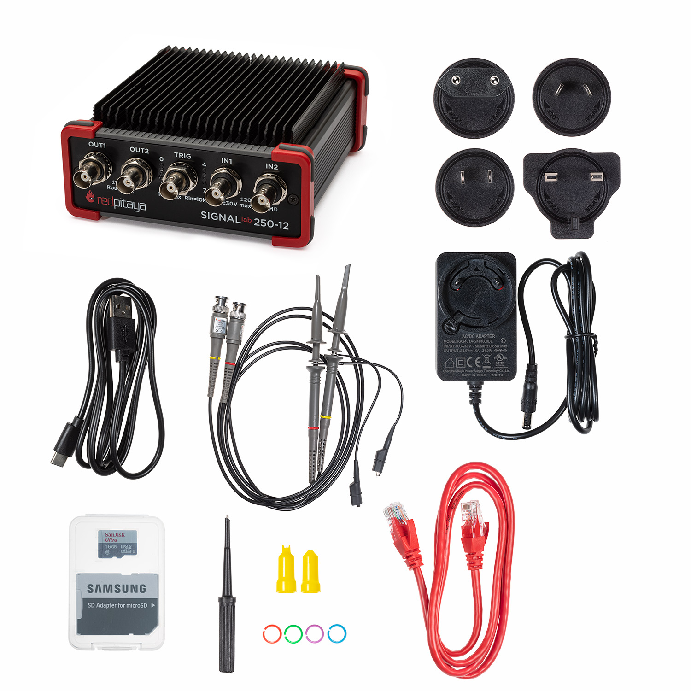

SIGNALlab 250-12 Standard Kit
#############################

    *SKU: IZD0024*
  

About the product
-----------------

SIGNALlab 250-12 is most sophisticated Red Pitaya product, built for more demanding industrial applications and research, where robustness and performance matter more than cost.

All SIGNALlab 250-12 products are now equipped with PoE (power over ethernet), which provides the possibility of powering and communicating with SIGNALlab using over one single ethernet cable. It saves time and costs of installation by reducing the time and expense of having electrical power cabling installed and is also safer due to intelligent POE delivery that is designed to protect network equipment from incorrect installation, overloads, or underpowering.

The device has full software control over the hardware and additional hardware features compared to other Red Pitaya products. Its larger Xilinx Zynq 7020 FPGA enables greater real-time processing capabilities plus a faster 250 Msps sampling rate, and just like other Red Pitaya products it offers the benefits of remote access, with an online app user interface accessible through Ethernet or Wi-Fi.

What is in the box
------------------

    * Red Pitaya SIGNALlab 250-12 board in Aluminium Housing
    * SD card (16 GB, class 10)
    * Ethernet cable (1 m)
    * Power supply (24 V, 1 A)
    * Oscilloscope probes
    * USB-A to USB-C cable

Technical specifications
------------------------

.. table::
    :widths: 10 18

    +------------------------------------+------------------------------------+
    | **Basic**                                                               |
    +====================================+====================================+
    | Processor                          | DUAL CORE ARM CORTEX A9            |
    +------------------------------------+------------------------------------+
    | FPGA                               | FPGA Xilinx Zynq 7020 SOC          |
    +------------------------------------+------------------------------------+
    | RAM                                | 1 GB (8 Gb)                        |
    +------------------------------------+------------------------------------+
    | System memory                      | Micro SD up to 32 GB               |
    +------------------------------------+------------------------------------+
    | Console connection                 | USB-C                              |
    +------------------------------------+------------------------------------+
    | Power connector                    | | Power Jack                       |
    |                                    | | RJ45 (PoE version only)          |
    +------------------------------------+------------------------------------+
    | Power consumption                  | 24 V, 0.5 A max                    |
    +------------------------------------+------------------------------------+

.. table::
    :widths: 10 18

    +------------------------------------+------------------------------------+
    | **Connectivity**                                                        |
    +====================================+====================================+
    | Ethernet                           | 1 Gbit                             |
    +------------------------------------+------------------------------------+
    | USB                                | 2 x USB 2.0                        |
    +------------------------------------+------------------------------------+
    | WIFI                               | requires WIFI dongle               |
    +------------------------------------+------------------------------------+

.. table::
    :widths: 10 18

    +------------------------------------+------------------------------------+
    | **RF inputs**                                                           |
    +====================================+====================================+
    | RF input channels                  | 2                                  |
    +------------------------------------+------------------------------------+
    | Sample rate                        | 250 MS/s                           |
    +------------------------------------+------------------------------------+
    | ADC resolution                     | 12 bit                             |
    +------------------------------------+------------------------------------+
    | Input impedance                    | 1 MOhm                             |
    +------------------------------------+------------------------------------+
    | Full scale voltage range           | +-1 V/+-20 V (software selectable) |
    +------------------------------------+------------------------------------+
    | Input coupling                     | AC / DC (software selectable)      |
    +------------------------------------+------------------------------------+
    | Absolute max. Input voltage range  | 30 V                               |
    |                                    |                                    |
    +------------------------------------+------------------------------------+
    | Input ESD protection               | Yes                                |
    +------------------------------------+------------------------------------+
    | Overload protection                | Protection diodes                  |
    +------------------------------------+------------------------------------+
    | Bandwidth                          | DC - 60 MHz                        |
    +------------------------------------+------------------------------------+

.. table::
    :widths: 10 18

    +------------------------------------+------------------------------------+
    | **RF outputs**                                                          |
    +====================================+====================================+
    | RF output channels                 | 2                                  |
    +------------------------------------+------------------------------------+
    | Sample rate                        | 250 MS/s                           |
    +------------------------------------+------------------------------------+
    | DAC resolution                     | 14 bit                             |
    +------------------------------------+------------------------------------+
    | Load impedance                     | 50 Ohm                             |
    +------------------------------------+------------------------------------+
    | Voltage range                      | +-2 V / +-10 V (Hi-Z load)         |
    |                                    | (software selectable)              |
    +------------------------------------+------------------------------------+
    | Short circut protection            | Yes                                |
    |                                    |                                    |
    +------------------------------------+------------------------------------+
    | Connector type                     | BNC                                |
    +------------------------------------+------------------------------------+
    | Output slew rate                   | 10 V / 17 ns                       |
    +------------------------------------+------------------------------------+
    | Bandwidth                          | DC - 60 MHz                        |
    +------------------------------------+------------------------------------+

.. table::
    :widths: 10 18

    +------------------------------------+------------------------------------+
    | **Extension connector**                                                 | 
    +====================================+====================================+
    | Digital IOs                        | 16                                 |
    +------------------------------------+------------------------------------+
    | Analog inputs                      | 4                                  |
    +------------------------------------+------------------------------------+
    | Analog inputs voltage range        | 0-3.5 V                            |
    +------------------------------------+------------------------------------+
    | Sample rate                        | 100 kS/s                           |
    +------------------------------------+------------------------------------+
    | Resolution                         | 12 bit                             |
    +------------------------------------+------------------------------------+
    | Analog outputs                     | 4                                  |
    +------------------------------------+------------------------------------+
    | Analog outputs voltage range       | 0-1.8 V                            |
    +------------------------------------+------------------------------------+
    | Communication interfaces           | I2C, SPI, UART                     |
    +------------------------------------+------------------------------------+
    | Available voltages                 | +5 V, +3.3 V, -4 V                 |
    +------------------------------------+------------------------------------+
    | external ADC clock                 |  yes                               |
    +------------------------------------+------------------------------------+

.. table::
    :widths: 10 18

    +------------------------------------+------------------------------------+
    | **Synchronisation**                                                     |
    +====================================+====================================+
    | Trigger input                      | Through BNC connector              |
    +------------------------------------+------------------------------------+
    | Daisy chain connection             | | Over SATA connection             |
    |                                    | | (up to 500 Mbps)                 |
    +------------------------------------+------------------------------------+
    | Ref. clock input                   | Through SMA connector              |
    +------------------------------------+------------------------------------+

.. table::
    :widths: 10 18

    +------------------------------------+------------------------------------+
    | **More**                                                                |
    +====================================+====================================+
    | Use case                           | Industry                           |
    +------------------------------------+------------------------------------+
    | Weight                             | 1 kg                               |
    +------------------------------------+------------------------------------+
    | Dimensions                         | 41 x 14.5 x 9 cm                   |
    +------------------------------------+------------------------------------+

More information on the links below:
    * `Quick start <https://redpitaya.readthedocs.io/en/latest/quickStart/quickStart.html#quick-start>`_
    * `Applications & Features <https://redpitaya.readthedocs.io/en/latest/appsFeatures/appsFeatures.html#applications-and-features>`_
    * `Product comparison table <https://redpitaya.readthedocs.io/en/latest/developerGuide/hardware/compares/vs.html#product-comparison-table>`_
    * `Hardware specifications <https://redpitaya.readthedocs.io/en/latest/developerGuide/hardware/250-12/top.html#signallab-250-12>`_
    * `Software development <https://redpitaya.readthedocs.io/en/latest/developerGuide/software/software.html#software>`_

Webstore link
-------------

    * `SIGNALlab 250-12 Standard Kit <https://redpitaya.com/product/signallab-250-12-standard-kit/>`_

