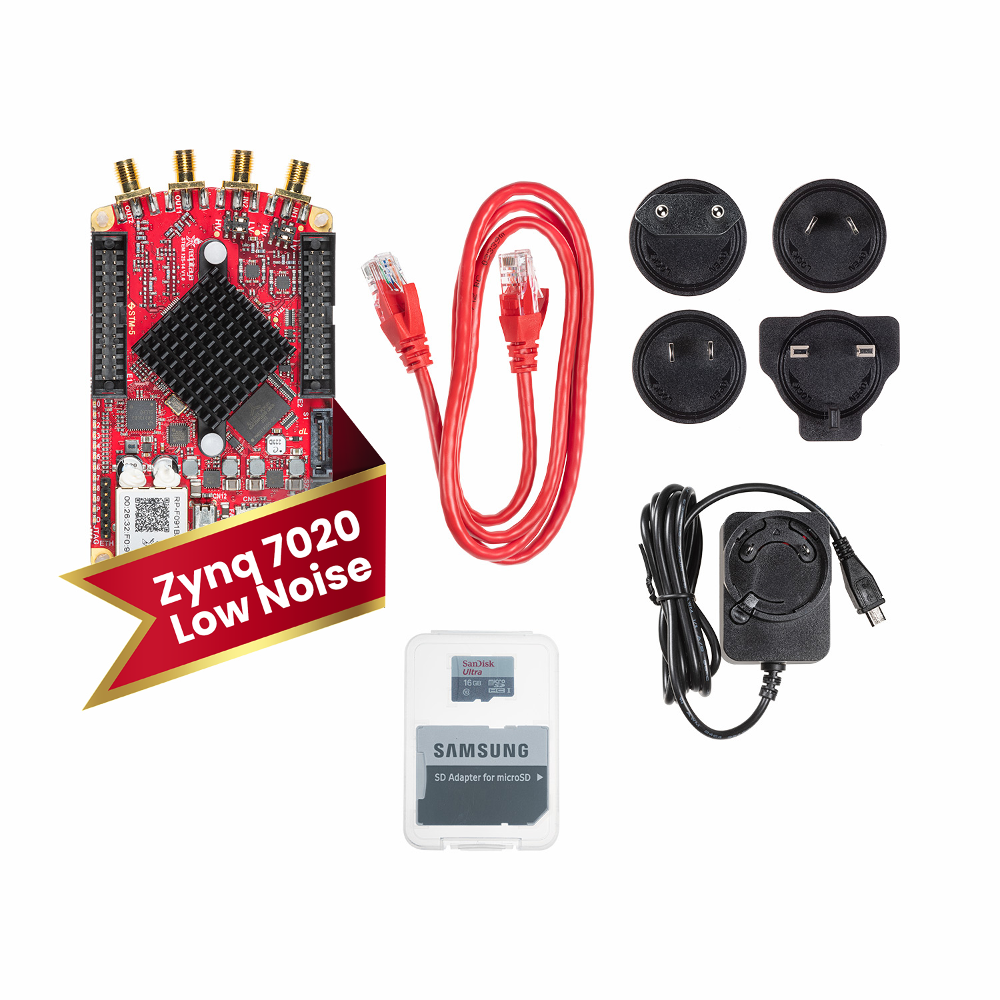

STEMlab 125-14 Z7020 Low-Noise Starter Kit
##########################################

   *SKU: IZD0029*
   

About the product
-----------------

STEMlab 125-14 is our most versatile and popular product, which was introduced to the market in 2013 when Red Pitaya was established. Since then it has been used in wide variety of contexts, from hobbyists and ham radio operators to industry, research and space applications.

STEMlab 125-14 Z7020 Low Noise is based on a STEMlab 125-14 Z7020 board that is populated with additional linear analog power for analog power supplies to reduce RF inputs and outputs noise and consequently increase ENOB.

Comes with Xilinx Zynq 7020 SoC instead of the Zynq 7010 SoC.

What is in the box
------------------

    * Red Pitaya STEMlab 125-14-Z7020 Low-Noise board
    * SD card (16 GB, class 10)
    * Ethernet cable (1 m)
    * Power supply (5 V, 2 A)

Technical specifications
------------------------

.. table::
    :widths: 10 18

    +------------------------------------+------------------------------------+
    | **Basic**                                                               |
    +====================================+====================================+
    | Processor                          | DUAL CORE ARM CORTEX A9            |
    +------------------------------------+------------------------------------+
    | FPGA                               | FPGA Xilinx Zynq 7020 SOC          |
    +------------------------------------+------------------------------------+
    | RAM                                | 512 MB (4 Gb)                      |
    +------------------------------------+------------------------------------+
    | System memory                      | Micro SD up to 32 GB               |
    +------------------------------------+------------------------------------+
    | Console connection                 | Micro USB                          |
    +------------------------------------+------------------------------------+
    | Power connector                    | Micro USB                          |
    |                                    |                                    |
    +------------------------------------+------------------------------------+
    | Power consumption                  | 5 V, 2 A max                       |
    +------------------------------------+------------------------------------+

.. table::
    :widths: 10 18

    +------------------------------------+------------------------------------+
    | **Connectivity**                                                        |
    +====================================+====================================+
    | Ethernet                           | 1 Gbit                             |
    +------------------------------------+------------------------------------+
    | USB                                | USB 2.0                            |
    +------------------------------------+------------------------------------+
    | WIFI                               | requires WIFI dongle               |
    +------------------------------------+------------------------------------+

.. table::
    :widths: 10 18

    +------------------------------------+------------------------------------+
    | **RF inputs**                                                           |
    +====================================+====================================+
    | RF input channels                  | 2                                  |
    +------------------------------------+------------------------------------+
    | Sample rate                        | 125 MS/s                           |
    +------------------------------------+------------------------------------+
    | ADC resolution                     | 14 bit                             |
    +------------------------------------+------------------------------------+
    | Input impedance                    | 1 MOhm / 10 pF                     |
    +------------------------------------+------------------------------------+
    | Full scale voltage range           | ±1 V (LV) and ±20 V (HV)           |
    +------------------------------------+------------------------------------+
    | Input coupling                     | DC                                 |
    +------------------------------------+------------------------------------+
    | Absolute max. Input voltage range  | 30 V                               |
    |                                    |                                    |
    +------------------------------------+------------------------------------+
    | Input ESD protection               | Yes                                |
    +------------------------------------+------------------------------------+
    | Overload protection                | Protection diodes                  |
    +------------------------------------+------------------------------------+
    | Bandwidth                          | DC - 60 MHz                        |
    +------------------------------------+------------------------------------+

.. table::
    :widths: 10 18

    +------------------------------------+------------------------------------+
    | **RF outputs**                                                          |
    +====================================+====================================+
    | RF output channels                 | 2                                  |
    +------------------------------------+------------------------------------+
    | Sample rate                        | 125 MS/s                           |
    +------------------------------------+------------------------------------+
    | DAC resolution                     | 14 bit                             |
    +------------------------------------+------------------------------------+
    | Load impedance                     | 50 Ohm                             |
    +------------------------------------+------------------------------------+
    | Voltage range                      | ±1 V                               |
    |                                    |                                    |
    +------------------------------------+------------------------------------+
    | Short circut protection            | Yes                                |
    |                                    |                                    |
    +------------------------------------+------------------------------------+
    | Connector type                     | SMA                                |
    +------------------------------------+------------------------------------+
    | Output slew rate                   | 2 V / 10 ns                        |
    +------------------------------------+------------------------------------+
    | Bandwidth                          | DC - 50 MHz                        |
    +------------------------------------+------------------------------------+

.. table::
    :widths: 10 18

    +------------------------------------+------------------------------------+
    | **Extension connector**                                                 | 
    +====================================+====================================+
    | Digital IOs                        | 16                                 |
    +------------------------------------+------------------------------------+
    | Analog inputs                      | 4                                  |
    +------------------------------------+------------------------------------+
    | Analog inputs voltage range        | 0-3.5 V                            |
    +------------------------------------+------------------------------------+
    | Sample rate                        | 100 kS/s                           |
    +------------------------------------+------------------------------------+
    | Resolution                         | 12 bit                             |
    +------------------------------------+------------------------------------+
    | Analog outputs                     | 4                                  |
    +------------------------------------+------------------------------------+
    | Analog outputs voltage range       | 0-1.8 V                            |
    +------------------------------------+------------------------------------+
    | Communication interfaces           | I2C, SPI, UART                     |
    +------------------------------------+------------------------------------+
    | Available voltages                 | +5 V, +3.3 V, -4 V                 |
    +------------------------------------+------------------------------------+
    | external ADC clock                 |  yes                               |
    +------------------------------------+------------------------------------+

.. table::
    :widths: 10 18

    +------------------------------------+------------------------------------+
    | **Synchronisation**                                                     |
    +====================================+====================================+
    | Trigger input                      | Through extension connector        |
    +------------------------------------+------------------------------------+
    | Daisy chain connection             | | Over SATA connection             |
    |                                    | | (up to 500 Mbps)                 |
    +------------------------------------+------------------------------------+
    | Ref. clock input                   | N/A                                |
    +------------------------------------+------------------------------------+

.. table::
    :widths: 10 18

    +------------------------------------+------------------------------------+
    | **More**                                                                |
    +====================================+====================================+
    | Use case                           |                                    |
    +------------------------------------+------------------------------------+
    | Weight                             | 0.5 kg                             |
    +------------------------------------+------------------------------------+
    | Dimensions                         | 22 x 15 x 8 cm                     |
    +------------------------------------+------------------------------------+

More information on the links below:
    * `Quick start <https://redpitaya.readthedocs.io/en/latest/quickStart/quickStart.html#quick-start>`_
    * `Applications & Features <https://redpitaya.readthedocs.io/en/latest/appsFeatures/appsFeatures.html#applications-and-features>`_
    * `Product comparison table <https://redpitaya.readthedocs.io/en/latest/developerGuide/hardware/compares/vs.html#product-comparison-table>`_
    * `Hardware specifications <https://redpitaya.readthedocs.io/en/latest/developerGuide/hardware/125-14-Z20/top.html#stemlab-125-14-z7020-ln>`_
    * `Software development <https://redpitaya.readthedocs.io/en/latest/developerGuide/software/software.html#software>`_

Webstore link
-------------

    * `STEMlab 125-14 Z7020 Low Noise Starter Kit <https://redpitaya.com/product/stemlab-125-14-z7020-low-noise-starter-kit/>`_

