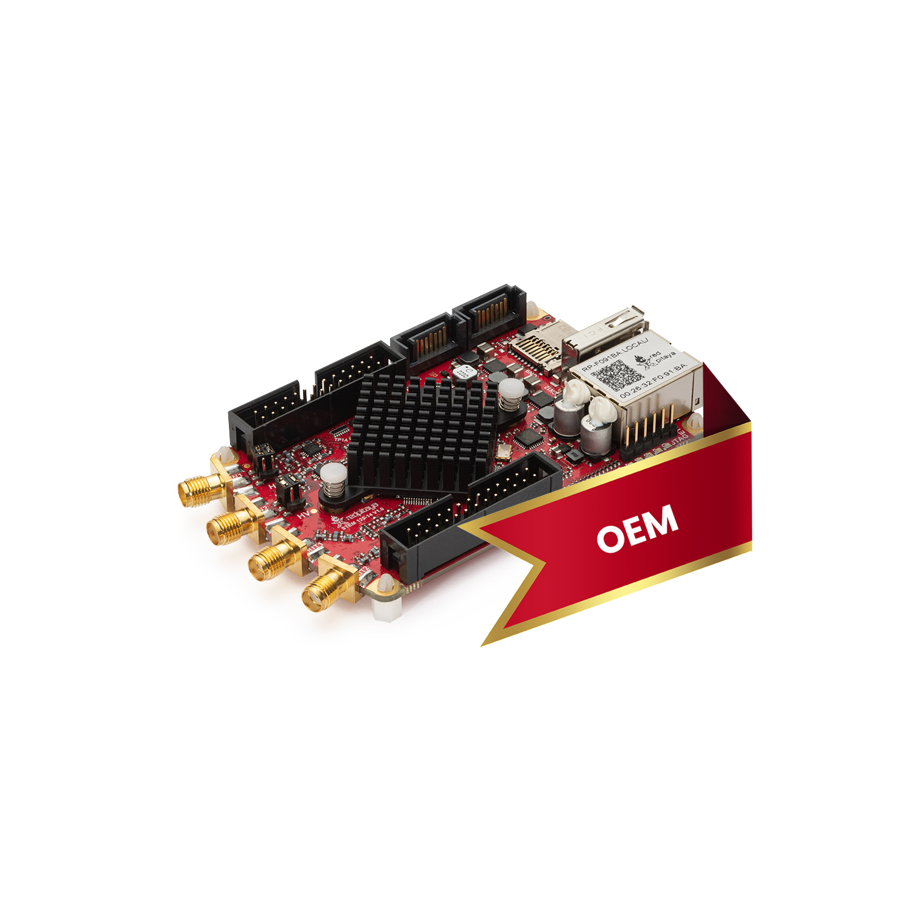

STEMlab 125-14 Board for OEM partners
#####################################

    *SKU: MAT0016*

About the product
-----------------

We are setting the industry standard in product quality and customer support, our STEMlab OEM boards are easy to integrate and available in multiple hardware and software configurations.

STEMlab 125-14 is our most versatile and popular product, which was introduced to the market in 2013 when Red Pitaya was established. Since then it has been used in wide variety of contexts, from hobbyists and ham radio operators to industry, research and space applications.

It has two 125 Msps 14-bit inputs and two 14-bit outputs, Xilinx Zynq 7010 FPGA and offers remote access, with an online app user interface accessible through Ethernet or Wi-Fi.

.. What is in the box
.. ------------------
.. 
  * Red Pitaya STEMlab 125-14 board
  * SD card (16 GB, class 10)
  * Ethernet cable (1 m)
  * Power supply (5 V, 2 A)

Technical specifications
------------------------

.. table::
    :widths: 10 18

    +------------------------------------+------------------------------------+
    | **Basic**                                                               |
    +====================================+====================================+
    | Processor                          | DUAL CORE ARM CORTEX A9            |
    +------------------------------------+------------------------------------+
    | FPGA                               | FPGA Xilinx Zynq 7010 SOC          |
    +------------------------------------+------------------------------------+
    | RAM                                | 512 MB (4 Gb)                      |
    +------------------------------------+------------------------------------+
    | System memory                      | Micro SD up to 32 GB               |
    +------------------------------------+------------------------------------+
    | Console connection                 | Micro USB                          |
    +------------------------------------+------------------------------------+
    | Power connector                    | Micro USB                          |
    |                                    |                                    |
    +------------------------------------+------------------------------------+
    | Power consumption                  | 5 V, 2 A max                       |
    +------------------------------------+------------------------------------+

.. table::
    :widths: 10 18

    +------------------------------------+------------------------------------+
    | **Connectivity**                                                        |
    +====================================+====================================+
    | Ethernet                           | 1 Gbit                             |
    +------------------------------------+------------------------------------+
    | USB                                | USB 2.0                            |
    +------------------------------------+------------------------------------+
    | WIFI                               | requires WIFI dongle               |
    +------------------------------------+------------------------------------+

.. table::
    :widths: 10 18

    +------------------------------------+------------------------------------+
    | **RF inputs**                                                           |
    +====================================+====================================+
    | RF input channels                  | 2                                  |
    +------------------------------------+------------------------------------+
    | Sample rate                        | 125 MS/s                           |
    +------------------------------------+------------------------------------+
    | ADC resolution                     | 14 bit                             |
    +------------------------------------+------------------------------------+
    | Input impedance                    | 1 MOhm / 10 pF                     |
    +------------------------------------+------------------------------------+
    | Full scale voltage range           | ±1 V (LV) and ±20 V (HV)           |
    +------------------------------------+------------------------------------+
    | Input coupling                     | DC                                 |
    +------------------------------------+------------------------------------+
    | Absolute max. Input voltage range  | 30 V                               |
    |                                    |                                    |
    +------------------------------------+------------------------------------+
    | Input ESD protection               | Yes                                |
    +------------------------------------+------------------------------------+
    | Overload protection                | Protection diodes                  |
    +------------------------------------+------------------------------------+
    | Bandwidth                          | DC - 60 MHz                        |
    +------------------------------------+------------------------------------+

.. table::
    :widths: 10 18

    +------------------------------------+------------------------------------+
    | **RF outputs**                                                          |
    +====================================+====================================+
    | RF output channels                 | 2                                  |
    +------------------------------------+------------------------------------+
    | Sample rate                        | 125 MS/s                           |
    +------------------------------------+------------------------------------+
    | DAC resolution                     | 14 bit                             |
    +------------------------------------+------------------------------------+
    | Load impedance                     | 50 Ohm                             |
    +------------------------------------+------------------------------------+
    | Voltage range                      | ±1 V                               |
    |                                    |                                    |
    +------------------------------------+------------------------------------+
    | Short circut protection            | Yes                                |
    |                                    |                                    |
    +------------------------------------+------------------------------------+
    | Connector type                     | SMA                                |
    +------------------------------------+------------------------------------+
    | Output slew rate                   | 2 V / 10 ns                        |
    +------------------------------------+------------------------------------+
    | Bandwidth                          | DC - 50 MHz                        |
    +------------------------------------+------------------------------------+

.. table::
    :widths: 10 18

    +------------------------------------+------------------------------------+
    | **Extension connector**                                                 | 
    +====================================+====================================+
    | Digital IOs                        | 16                                 |
    +------------------------------------+------------------------------------+
    | Analog inputs                      | 4                                  |
    +------------------------------------+------------------------------------+
    | Analog inputs voltage range        | 0-3.5 V                            |
    +------------------------------------+------------------------------------+
    | Sample rate                        | 100 kS/s                           |
    +------------------------------------+------------------------------------+
    | Resolution                         | 12 bit                             |
    +------------------------------------+------------------------------------+
    | Analog outputs                     | 4                                  |
    +------------------------------------+------------------------------------+
    | Analog outputs voltage range       | 0-1.8 V                            |
    +------------------------------------+------------------------------------+
    | Communication interfaces           | I2C, SPI, UART                     |
    +------------------------------------+------------------------------------+
    | Available voltages                 | +5 V, +3.3 V, -4 V                 |
    +------------------------------------+------------------------------------+
    | external ADC clock                 |  yes                               |
    +------------------------------------+------------------------------------+

.. table::
    :widths: 10 18

    +------------------------------------+------------------------------------+
    | **Synchronisation**                                                     |
    +====================================+====================================+
    | Trigger input                      | Through extension connector        |
    +------------------------------------+------------------------------------+
    | Daisy chain connection             | | Over SATA connection             |
    |                                    | | (up to 500 Mbps)                 |
    +------------------------------------+------------------------------------+
    | Ref. clock input                   | N/A                                |
    +------------------------------------+------------------------------------+

.. table::
    :widths: 10 18

    +------------------------------------+------------------------------------+
    | **More**                                                                |
    +====================================+====================================+
    | Use case                           | Industry                           |
    +------------------------------------+------------------------------------+
    | Weight                             | 0.5 kg                             |
    +------------------------------------+------------------------------------+
    | Dimensions                         | 14 x 10 x 4.5 cm                   |
    +------------------------------------+------------------------------------+

More information on the links below:
    * `Quick start <https://redpitaya.readthedocs.io/en/latest/quickStart/quickStart.html#quick-start>`_
    * `Applications & Features <https://redpitaya.readthedocs.io/en/latest/appsFeatures/appsFeatures.html#applications-and-features>`_
    * `Product comparison table <https://redpitaya.readthedocs.io/en/latest/developerGuide/hardware/compares/vs.html#product-comparison-table>`_
    * `Hardware specifications <https://redpitaya.readthedocs.io/en/latest/developerGuide/hardware/125-14/top.html#stemlab-125-14>`_
    * `Software development <https://redpitaya.readthedocs.io/en/latest/developerGuide/software/software.html#software>`_

Webstore link
-------------

    * `STEMlab 125-14 Board for OEM partners <https://redpitaya.com/product/stemlab-125-14-board-for-oem-partners/>`_

