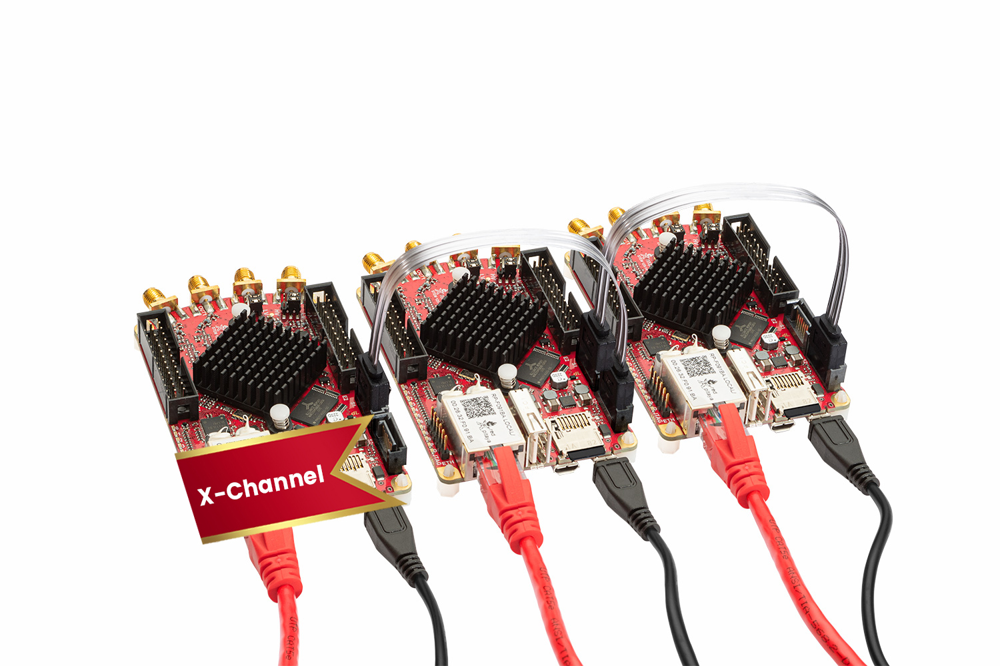
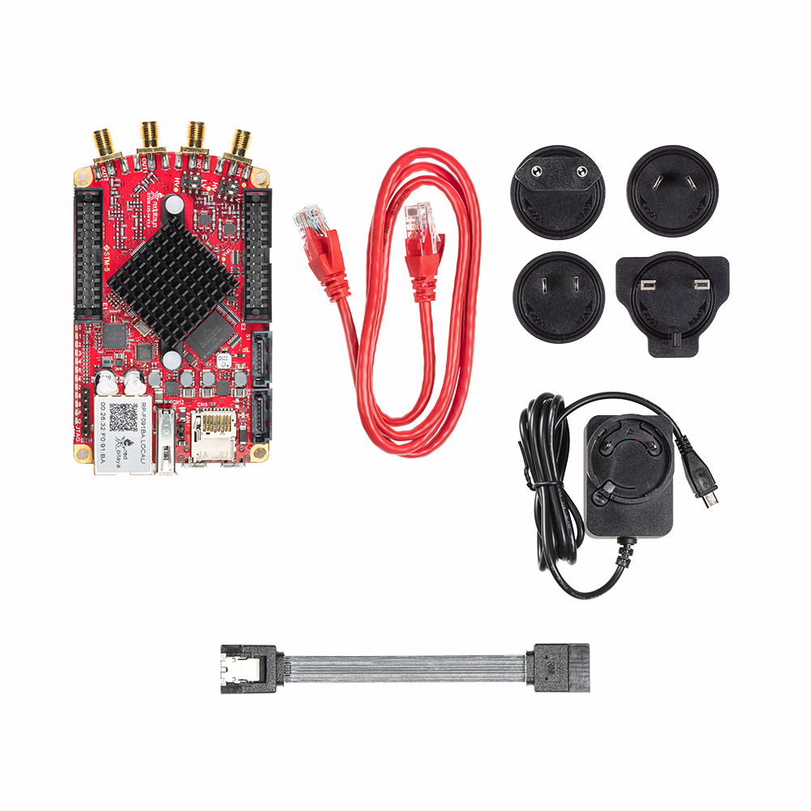

STEMlab 125-14 X-Channel System
###############################

    *SKU: N/A*
    

    

About the product
-----------------

STEMlab 125-14 X-Channel System is designed for applications that require multi-channel RF signal acquisition and generation.  

It enables the user to stream analog and digital signals from/to the client’s PC.

The X-Channel STEMlab 125-14 system consists of multiple Low-Noise STEMlab 125-14 devices that are modified for clock and trigger synchronization and also comes with SATA synchronisation cables and software that supports multi-channel RF signal acquisition and generation.

PRIMARY STEMlab 125-14 low-noise device provides clock and triggers to SECONDARY STEMlab 125-14 low-noise devices over SATA cable. With each added STEMlab 125-14 low-noise SECONDARY device system gains two additional RF inputs and two additional RF outputs. 

X-Channel streaming software provides the ability to stream RF analog and digital input and output signals from/to client PC and configure it completely remotely.

What is in the box
------------------

    * One Red Pitaya STEMlab 125-14 Low Noise (PRIMARY device) 
    * One or more Red Pitaya STEMlab 125-14 Low Noise SECONDARY devices that come with SATA synchronization cable

Each device in the kit comes with its own:

    * SD card (16 GB, class 10)
    * Ethernet cable (1 m)
    * Power supply (5 V, 2 A)

Technical specifications
------------------------

.. table::
    :widths: 10 18

    +------------------------------------+------------------------------------+
    | **Basic**                                                               |
    +====================================+====================================+
    | Processor                          | DUAL CORE ARM CORTEX A9            |
    +------------------------------------+------------------------------------+
    | FPGA                               | FPGA Xilinx Zynq 7010 SOC          |
    +------------------------------------+------------------------------------+
    | RAM                                | 512 MB (4 Gb)                      |
    +------------------------------------+------------------------------------+
    | System memory                      | Micro SD up to 32 GB               |
    +------------------------------------+------------------------------------+
    | Console connection                 | Micro USB                          |
    +------------------------------------+------------------------------------+
    | Power connector                    | Micro USB                          |
    |                                    |                                    |
    +------------------------------------+------------------------------------+
    | Power consumption                  | 5 V, 2 A max                       |
    +------------------------------------+------------------------------------+

.. table::
    :widths: 10 18

    +------------------------------------+------------------------------------+
    | **Connectivity**                                                        |
    +====================================+====================================+
    | Ethernet                           | 1 Gbit                             |
    +------------------------------------+------------------------------------+
    | USB                                | USB 2.0                            |
    +------------------------------------+------------------------------------+
    | WIFI                               | requires WIFI dongle               |
    +------------------------------------+------------------------------------+

.. table::
    :widths: 10 18

    +------------------------------------+------------------------------------+
    | **RF inputs**                                                           |
    +====================================+====================================+
    | RF input channels                  | 2                                  |
    +------------------------------------+------------------------------------+
    | Sample rate                        | 125 MS/s                           |
    +------------------------------------+------------------------------------+
    | ADC resolution                     | 14 bit                             |
    +------------------------------------+------------------------------------+
    | Input impedance                    | 1 MOhm / 10 pF                     |
    +------------------------------------+------------------------------------+
    | Full scale voltage range           | ±1 V (LV) and ±20 V (HV)           |
    +------------------------------------+------------------------------------+
    | Input coupling                     | DC                                 |
    +------------------------------------+------------------------------------+
    | Absolute max. Input voltage range  | 30 V                               |
    |                                    |                                    |
    +------------------------------------+------------------------------------+
    | Input ESD protection               | Yes                                |
    +------------------------------------+------------------------------------+
    | Overload protection                | Protection diodes                  |
    +------------------------------------+------------------------------------+
    | Bandwidth                          | DC - 60 MHz                        |
    +------------------------------------+------------------------------------+

.. table::
    :widths: 10 18

    +------------------------------------+------------------------------------+
    | **RF outputs**                                                          |
    +====================================+====================================+
    | RF output channels                 | 2                                  |
    +------------------------------------+------------------------------------+
    | Sample rate                        | 125 MS/s                           |
    +------------------------------------+------------------------------------+
    | DAC resolution                     | 14 bit                             |
    +------------------------------------+------------------------------------+
    | Load impedance                     | 50 Ohm                             |
    +------------------------------------+------------------------------------+
    | Voltage range                      | ±1 V                               |
    |                                    |                                    |
    +------------------------------------+------------------------------------+
    | Short circut protection            | Yes                                |
    |                                    |                                    |
    +------------------------------------+------------------------------------+
    | Connector type                     | SMA                                |
    +------------------------------------+------------------------------------+
    | Output slew rate                   | 2 V / 10 ns                        |
    +------------------------------------+------------------------------------+
    | Bandwidth                          | DC - 50 MHz                        |
    +------------------------------------+------------------------------------+

.. table::
    :widths: 10 18

    +------------------------------------+------------------------------------+
    | **Extension connector**                                                 | 
    +====================================+====================================+
    | Digital IOs                        | 16                                 |
    +------------------------------------+------------------------------------+
    | Analog inputs                      | 4                                  |
    +------------------------------------+------------------------------------+
    | Analog inputs voltage range        | 0-3.5 V                            |
    +------------------------------------+------------------------------------+
    | Sample rate                        | 100 kS/s                           |
    +------------------------------------+------------------------------------+
    | Resolution                         | 12 bit                             |
    +------------------------------------+------------------------------------+
    | Analog outputs                     | 4                                  |
    +------------------------------------+------------------------------------+
    | Analog outputs voltage range       | 0-1.8 V                            |
    +------------------------------------+------------------------------------+
    | Communication interfaces           | I2C, SPI, UART                     |
    +------------------------------------+------------------------------------+
    | Available voltages                 | +5 V, +3.3 V, -4 V                 |
    +------------------------------------+------------------------------------+
    | external ADC clock                 |  yes                               |
    +------------------------------------+------------------------------------+

.. table::
    :widths: 10 18

    +------------------------------------+------------------------------------+
    | **Synchronisation**                                                     |
    +====================================+====================================+
    | Trigger input                      | Through extension connector        |
    +------------------------------------+------------------------------------+
    | Daisy chain connection             | Over SATA connection |br|          |
    |                                    | (up to 500 Mbps)                   |
    +------------------------------------+------------------------------------+
    | Ref. clock input                   | N/A                                |
    +------------------------------------+------------------------------------+

.. table::
    :widths: 10 18

    +------------------------------------+------------------------------------+
    | **More**                                                                |
    +====================================+====================================+
    | Use case                           | Industry                           |
    +------------------------------------+------------------------------------+
    | Weight                             | 0.5 kg                             |
    +------------------------------------+------------------------------------+
    | Dimensions                         | 52 x 22 x 13 cm                    |
    +------------------------------------+------------------------------------+
    | Options                            | | 4-Ch IN + 4-Ch OUT               |
    |                                    | | 6-Ch IN + 6-Ch OUT               |
    |                                    | | ...                              |
    |                                    | | 16-Ch IN + 16-Ch OUT             |
    +------------------------------------+------------------------------------+

More information on the links below:
    * |quickstart|
    * |apps&features|
    * |X-channel-stream|
    * |comparison_table|
    * |hardware_specs|
    * |software|

Webstore link
-------------

    * |shop_link|

.. |quickstart| raw:: html

    <a href="https://redpitaya.readthedocs.io/en/latest/quickStart/quickStart.html#quick-start" target="_blank">Quick start</a>
    
.. |apps&features| raw:: html

    <a href="https://redpitaya.readthedocs.io/en/latest/appsFeatures/appsFeatures.html#applications-and-features" target="_blank">Applications & Features</a>
    
.. |X-channel-stream| raw:: html

    <a href="https://redpitaya.readthedocs.io/en/latest/appsFeatures/applications/streaming/appXCStreaming.html#x-channel-streaming" target="_blank">X-channel Streaming</a>

.. |comparison_table| raw:: html

    <a href="https://redpitaya.readthedocs.io/en/latest/developerGuide/hardware/compares/vs.html#product-comparison-table" target="_blank">Product comparison table</a>
    
.. |hardware_specs| raw:: html

    <a href="https://redpitaya.readthedocs.io/en/latest/developerGuide/hardware/125-14_MULTI/top.html#stemlab-125-14-x-channel-system" target="_blank">Hardware specifications</a>
    
.. |software| raw:: html

    <a href="https://redpitaya.readthedocs.io/en/latest/developerGuide/software/software.html#software" target="_blank">Software development</a>

.. |shop_link| raw:: html

    <a href="https://redpitaya.com/product/stemlab-125-14-x-channel-system/" target="_blank">STEMlab 125-14 X-Channel System</a>
